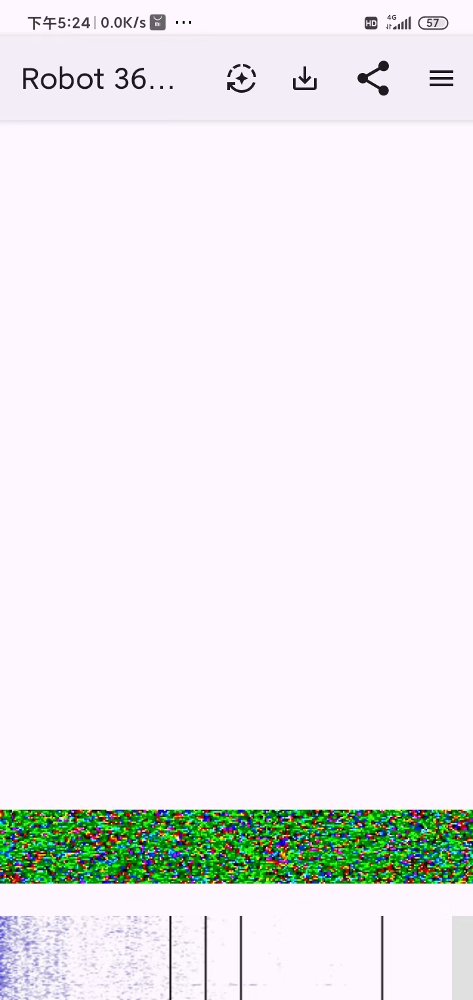

## SAKHACUBE-CHOLBON（RS18S）SSTV 活动

2026 年 7 月 28 日至 2026 年 8月 1 日，小型卫星**SAKHACUBE-CHOLBON（RS18S）SSTV 活动**将开展一次特别传输活动 
本次的活动的主题为**2026 儿童节主题图像从太空播出**，活动将持续约一周 

本次 SSTV 明信片由香港路德教会学校学生设计制作。 

---

## 传输内容

本次的SSTV的主题有：
 >🇷🇺🇨🇳俄中建交 77 周年 
 >俄中睦邻友好合作协定签署 25 周年 
 >2026–2027 俄中教育年
---

## 传输的时间表

**以下是传输的时间表**

|阶段|日期（UTC）|北京时间（UTC+8）|
|:-----------------|:-----------------|:-----------------|
|第一阶段|2026-07-28 03:00 — 2026-07-29 03:00|2026-07-28 11:00 — 2026-07-29 11:00|
|⏸ 技术中断|2026-07-29 03:00 — 2026-07-30 03:00|2026-07-29 11:00 — 2026-07-30 11:00|
|第二阶段|2026-07-30 03:00 — 2026-08-01 03:00|2026-07-30 11:00 — 2026-08-01 11:00|

---
## 技术参数

卫星：SAKHACUBE-CHOLBON（RS18S）） 
频率：437.350 MHz  
下传SSTV模式：Robot36 
传输形式：SSTV 图像

---
## 如何解码卫星下传的数据？

解码SSTV手机端可以使用[Robot36](https://github.com/xdsopl/robot36/releases)进行解码

电脑以Windows举例，可以使用[RX-SSTV](https://www.qsl.net/on6mu/rxsstv.htm)进行解码 

高仰角过境成功率更高哦（不对我在说什么废话） 
**祝大家接收顺利!!!**