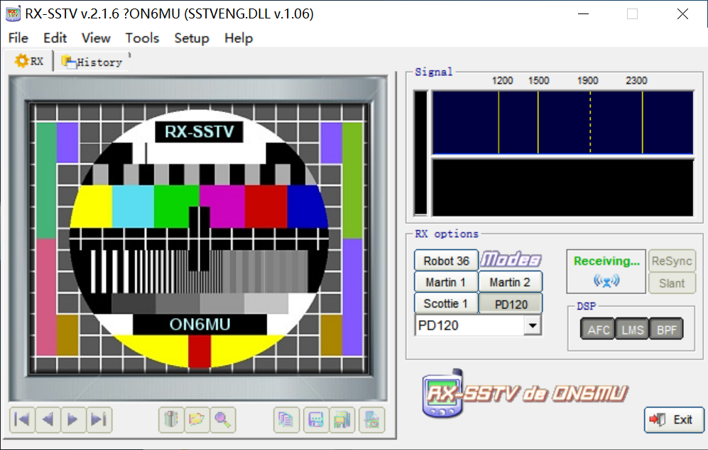

## MONITOR-3（RS58S）SSTV 活动

2026 年 7 月 28 日至 2026 年 8月 1 日，小型卫星**MONITOR-3（RS58S）SSTV 活动**将开展一次传输活动（虽然说今天是7月29日了，发出来水一下（不是）） 
本次的活动的主题为**俄罗斯科学院空间学校特别广播**，活动将持续 3 天 

---

## 传输内容

本次的SSTV的主题：
 >俄罗斯科学院空间学校特别广播
---

## 传输的时间表

**以下是传输的时间表**

|阶段|日期（UTC）|北京时间（UTC+8）|
|:-----------------|:-----------------|:-----------------|
|开始时间|2026 年 7 月 28 日 09:40 |2026 年 7 月 28 日 17:40|
|结束时间|2026 年 7 月 31 日 19:00 |2026 年 8 月 1 日 03:00|

---
## 技术参数

卫星：MONITOR-3（RS58S） 
频率：435.290 MHz  
下传SSTV模式：Robot36 
图像传输间隔：120 秒 
传输形式：SSTV 图像

---
## 如何解码卫星下传的数据？

解码SSTV手机端可以使用[Robot36](https://github.com/xdsopl/robot36/releases)进行解码

电脑以Windows举例，可以使用[RX-SSTV](https://www.qsl.net/on6mu/rxsstv.htm)进行解码 

高仰角过境成功率更高哦（不对我在说什么废话） 
**祝大家接收顺利!!!**