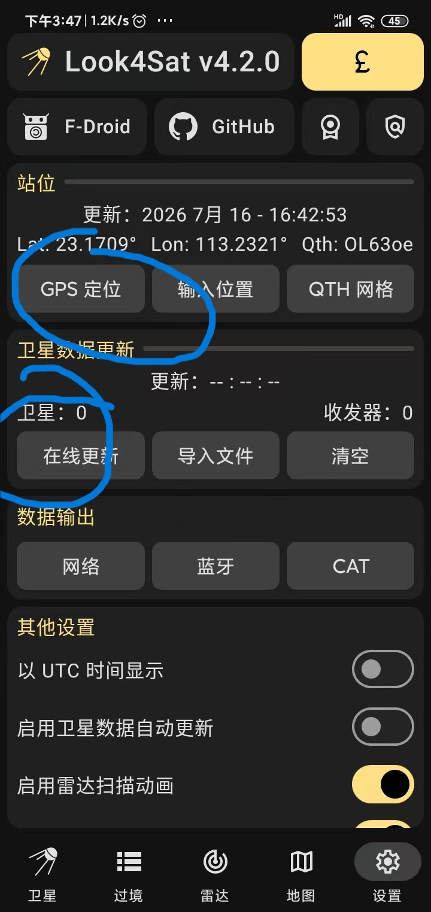
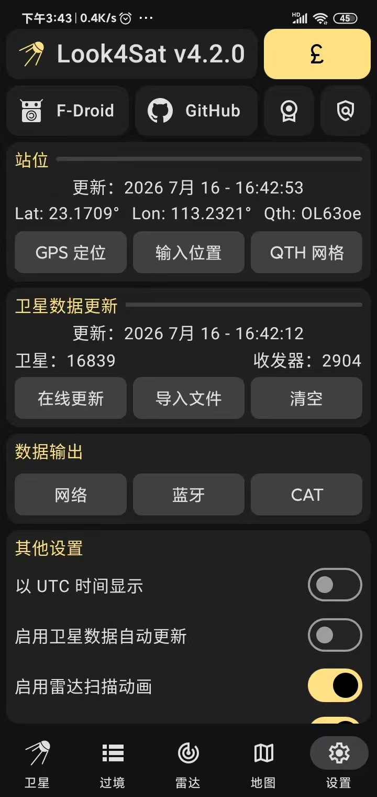
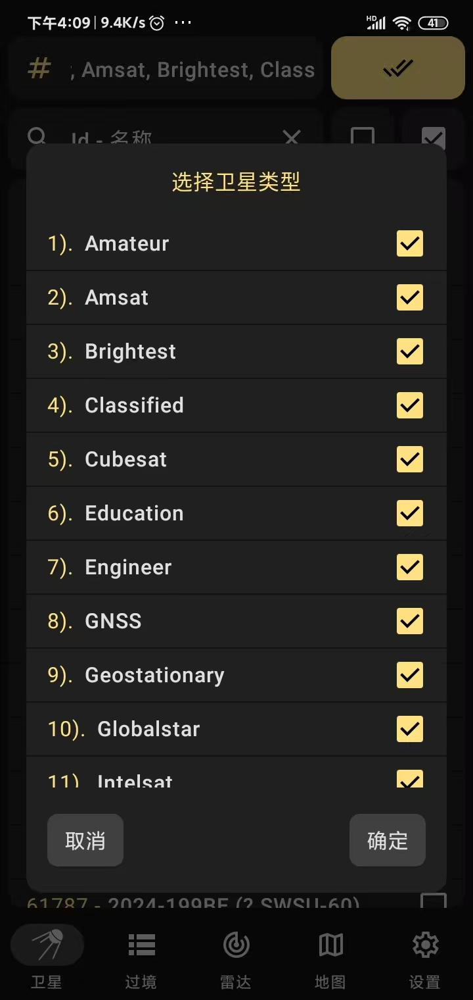
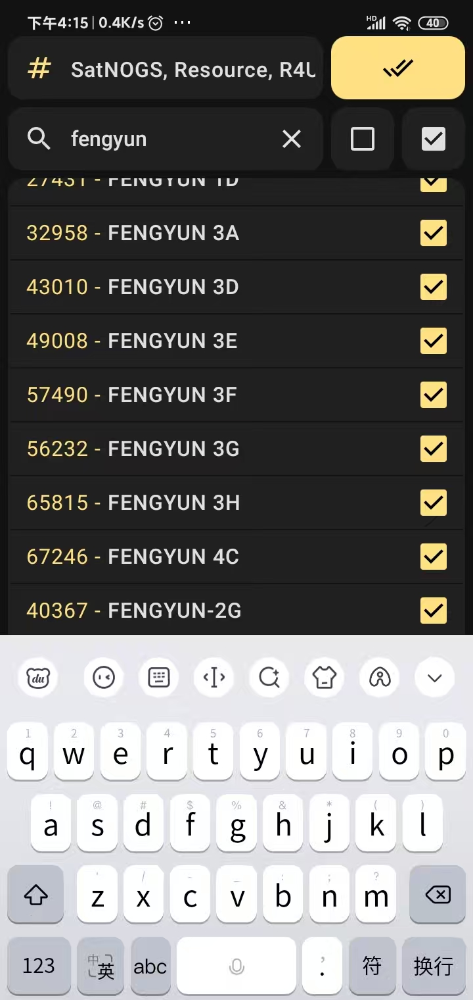
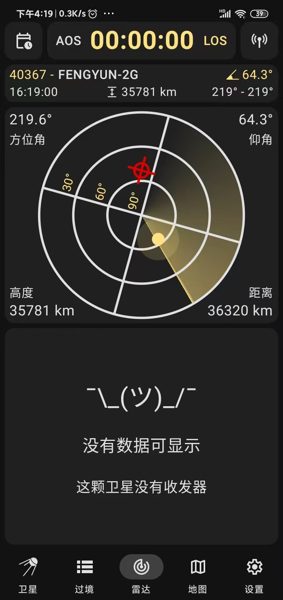
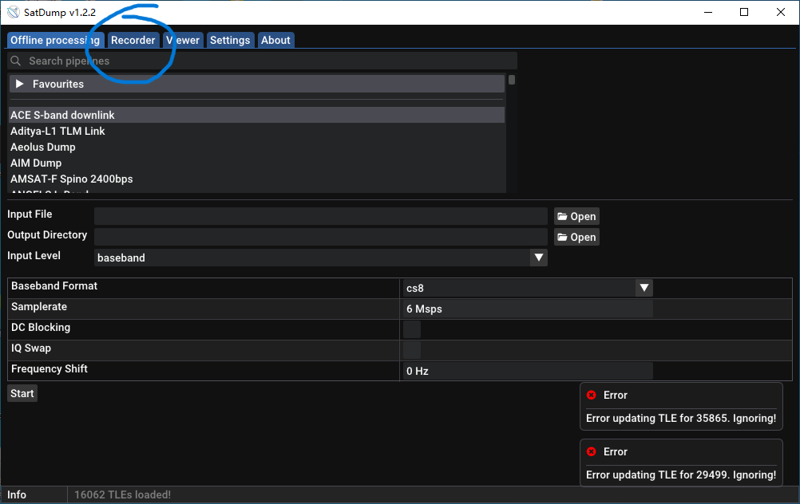
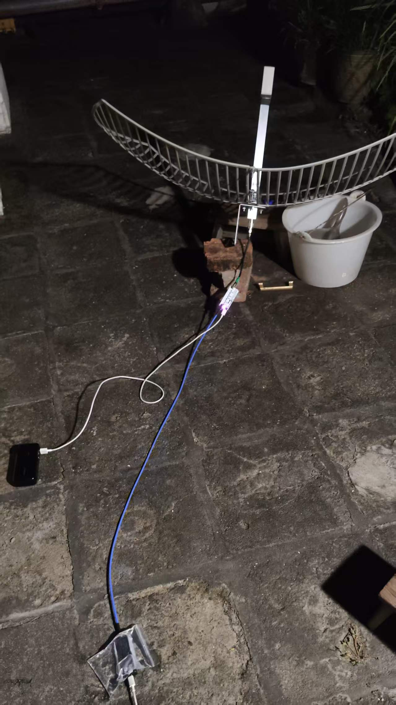
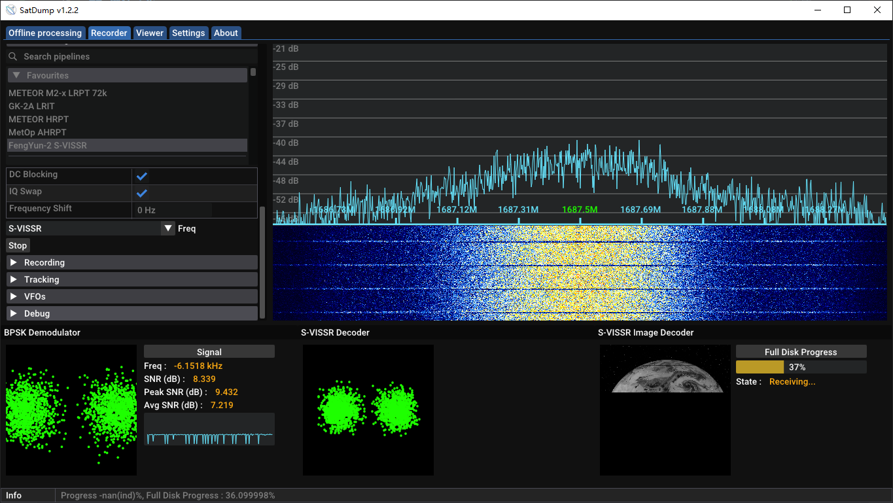

---
## 介绍
本次接收气象卫星是“风云二号G星”（以下简称FengYun-G 或 FY-2G） 

风云二号G星是风云二号03批业务卫星工程的第二颗星，属于地球静止轨道气象卫星。 
该星于2014年12月31日在西昌卫星发射中心发射，2015年1月6日定点于东经99.5°赤道上空 
详细请看[百科](https://baike.baidu.com/item/%E9%A3%8E%E4%BA%91%E4%BA%8C%E5%8F%B7G%E6%98%9F/17510090)（~~其实是想凑点字数~~）

---
## 准备工作

本次接收气象卫星是“风云二号G星”（以下简称FengYun-G 或 FY-2G） 
首先你要有一个抛物面天线，我选择的是栅格天线，馈源要选择中心频率工作在1.7G（算了我还是列一个表格吧） 

|材料|型号|
|:-----------------|:-----------------|
|栅格|1690MHz的馈源 + 抛物面|
|LNA（前置放大器）|流金或者是工作在1690MHz的LNA|
|SAW（滤波器）|其实这个~~可有可无~~，这里我没买过我就不做推荐了（）|
|馈线|50-3或更好的同轴线缆|
|SDR（软件定义无线电）|我这里使用的是RTL-SDR V4c，如果你有更好的SDR也可以用|
---

## 进行寻星

做好这一切后就可以开始准备收气象卫星了 
那么就会有人问怎么知道卫星在哪里呢？其实在[Look4Sat](https://github.com/rt-bishop/Look4Sat)里面可以找到  经常打业余卫星的都知道，[Look4Sat](https://github.com/rt-bishop/Look4Sat)是一个好用的寻星软件，你不知道也没关系。我来教你如何使用：） 

如果你还没下载[Look4Sat](https://github.com/rt-bishop/Look4Sat)先下载这一个软件 
你一打开，会发现什么也没有，别着急，你看软件的右下角，有一个“设置”的选项，点开 
点开后，你会发现什么也看不懂，别着急，按我的图片来 
首先要点击“在线更新”

更新好后就这样

更新好后点击左下角的“卫星” 
接下来就是选择卫星了，这边由于我不知道卫星的类型，我建议全部选上） 
所有卫星启动、启动、启动！还有这个！（客串）

类型选好后，就点击上面的搜索框，输入“FengYun 2G”或者“40367”

选择好后，你就可以点击下面的“过境”区域了 
如果不出意外的话，第一个选项就是一个叫做“FENGYUN-2G”的卫星 
点进去后就会有这个页面，此时雷达图上有一个黄色的小圆点，那个就是卫星了

一般来说，低纬度地区的FengYun-2G的仰角是很高的，例如我这里64° 

---

## 接收FengYun-2G
你现在应该把栅格对准卫星了吧，你接下来就要还要一个软件：[SatDump](https://www.satdump.org/posts/1.2.2-release/) 
如果你是安卓手机，请你下载APK安装；如果你是Windows或是Linux用户，请下载exe或是下载deb包（不对我在说什么废话） 
打开SatDump（我这里选择的是1.2.2） 
如果打开后看到好多英文，不要急，看窝的教程继续操作qaq 
点击上面的“Recorder”

接上你的SDR 
然后把天线接到你的SDR（给你们看看我的接收环境）

连接后点**Start**
往下滑找到**Processing**，你可以在搜索框里面搜索**FengYun-2G**选择一个叫做**FengYun-2G S-VISSR**的小条条 
把**DC Blocking**和**IQ Swap**旁边的小勾给打上 
再把**Freq**那个小条条那里选择**S-VISSR**点**Start**，这样就开始解码了

等右边的小条条跑满就有云图啦，接收FengYun-2G是不是很简单😋😋😋 
## 云图展示
给你们看看我接收的云图怎么样🤓 
**可见光**

**RGB彩色**

**红外**
