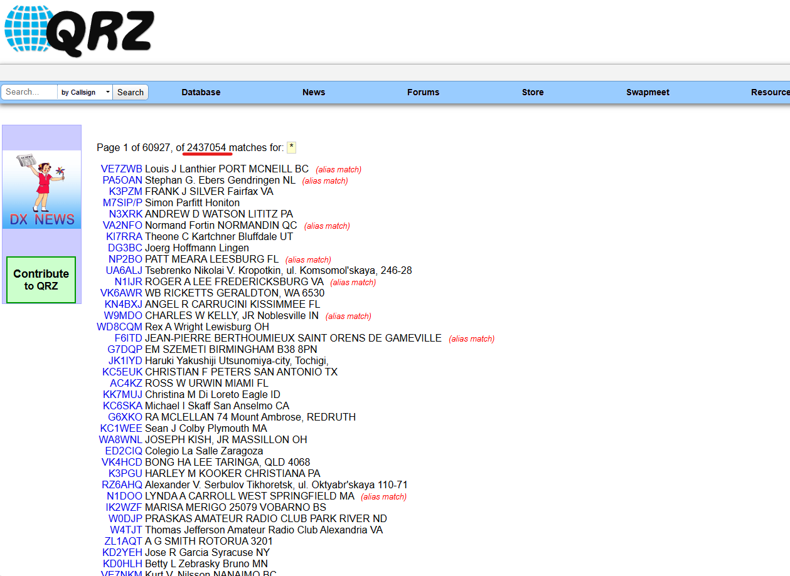
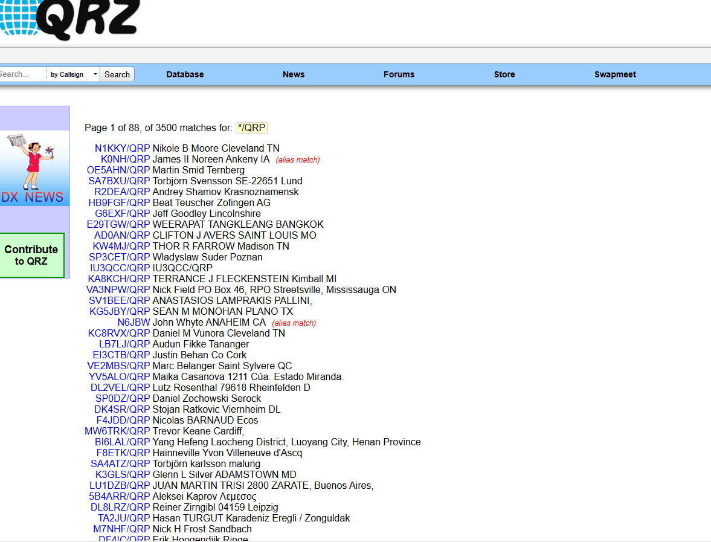
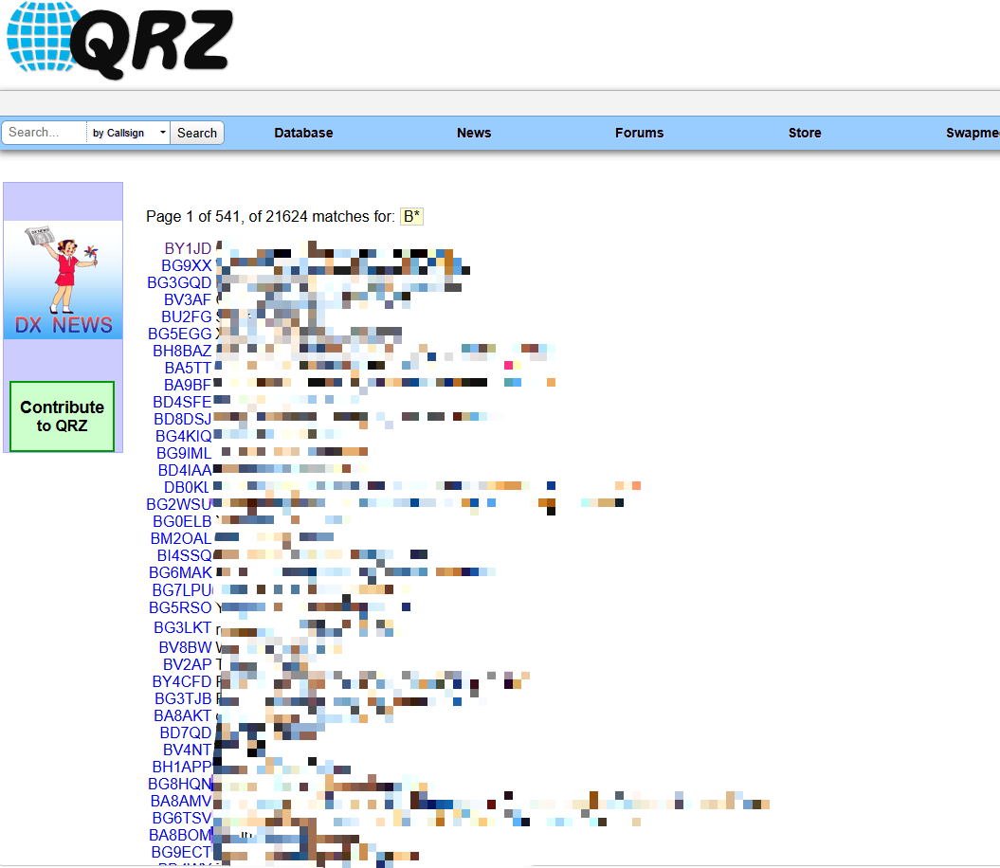
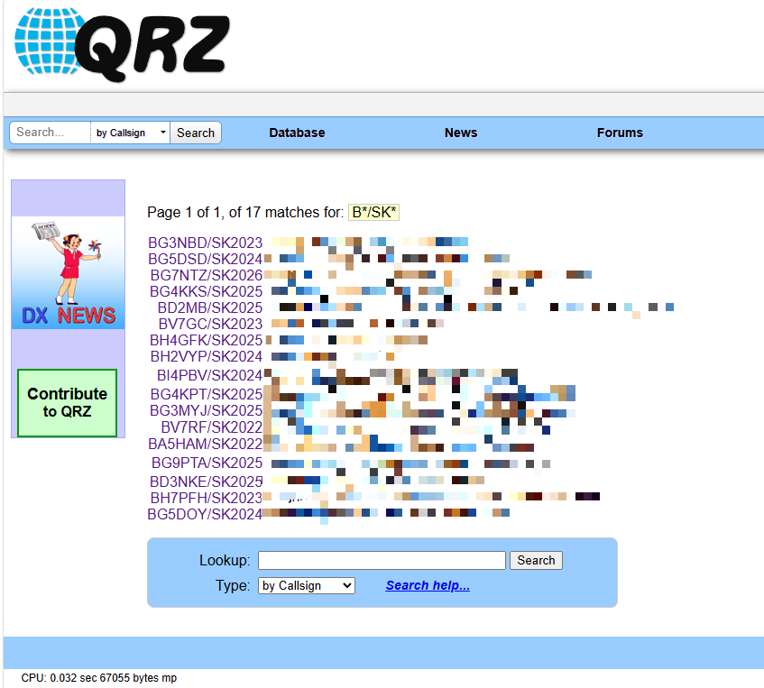

---

## QRZ的介绍
我这里先给一些刚入坑/完全不懂圈外人讲一下，[QRZ](https://qrz.com/)的作用是储存你的你的呼号信息，QRZ也可以说是**最权威的在线呼号查询数据库和社区平台**。 
（这个信息是有你来填写的，而不是你考取操作证后就知道你的全部信息，就像相当一个“通信录”） 

---

## QRZ的搜索方式

QRZ的搜索方式疑似就是一个“正则表达式”，例如说你在搜索框输入“*”，你就会发现搜索出来了整个QRZ网站的呼号结果。 
截止到02:55:13 UTC，QRZ网站呼号储存已经有**2437054**个呼号结果

依此类推，我们就可以这样搜索全世界的“/QPR”的电台 
只需要输入 

    */QRP

我们也可以这样搜索**中国大陆 + 中国台湾**的呼号 

    B????

或者 

    B*

:::tip
这里的“B????”指的是搜索“**B**”开头的四位数呼号 
则“B*”指的是“**B**”开头后边已注册的所有呼号，包括五位数的呼号 六位数的呼号 黄岩岛的四位数呼号。
:::
也就是说，我们还可以搜索已经“SK”的OM 
我先叠个甲，本篇章仅为如何利用QRZ的“**正则表达式**”进行搜索呼号 
以至于已经“SK”的OM，祝他们安息吧......  
如果你要搜索中国大陆 + 中国台湾已“SK”呼号 

    B*/SK*

在这里，你会看到为什么有我的呼号在这里，起因是**BG7SJU**在和他的朋友讨论QRZ的时候，搜索了“**B?????/SK2026**”就出现了我**BG7NTZ** 
:::tip
这里SK后面跟的是SK年份，这里也有可能是因为我的呼号是二次分配，与客服解释后将原来的信息转为了SK
:::

## 尾声
感谢你们看到这里，祝你们也好好生活，DE BG7NTZ！